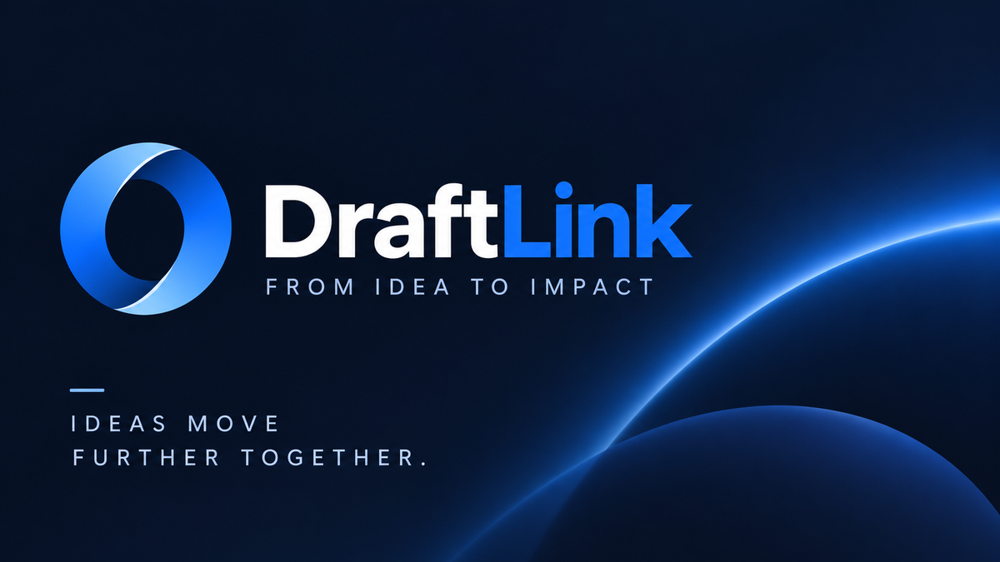

# draftlink

<p align="center"></p>

Publish HTML drafts from agents; searchable, shareable, status-tracked.

Draftlink is a personal service for hosting single HTML pages — plans, proposals,
briefs, architecture notes. Agents publish through the `draftlink` CLI; humans
browse and share through a web dashboard. Built for [Cloudflare Workers](https://workers.cloudflare.com) + D1.

## How it fits together

- **Worker** (`src/`) — serves drafts at `/d/<id>`, the dashboard, a Bearer-token
  API at `/api/drafts`, and GitHub OAuth sign-in.
- **CLI** (`bin/draftlink`) — dependency-free Node script. Agents call the CLI;
  the human logs in once and tokens never touch agent context.
- **Agent skill** (`skills/draftlink/`) — instructions that teach coding agents
  how to publish and read drafts.
- **Setup wizard** (`scripts/setup-draftlink.sh`) — walks you through deps, D1,
  a GitHub OAuth app, secrets, and the first deploy.

## Setup

**Use an existing deployment** (e.g. your own already-configured worker):
create an API key at `<your-worker>/keys`, then:

```sh
npm install -g draftlink
draftlink auth login          # paste the key once
```

**Self-host** (deploy your own worker): the setup wizard lives in the repo
and expects to run from a checkout — clone first:

```sh
git clone https://github.com/lm-sousa/draftlink.git && cd draftlink
npm install
./scripts/setup-draftlink.sh
```

The wizard walks you through deps, a D1 database, a GitHub OAuth app,
secrets, and the first deploy. It is safe to re-run; it remembers what it
already configured.

## CLI

```sh
draftlink auth login                          # paste an API key once (create it at <your-worker>/keys)
draftlink upload plan.html --title "My plan" --project myrepo
draftlink upload - < plan.html                # stdin
draftlink update <id> --file v2.html          # same public URL, no version history
draftlink update <id> --status done
draftlink read <id|url>                       # print draft HTML to stdout
draftlink list [query]                        # search title/project/content
draftlink delete <id>
draftlink auth status | auth logout
draftlink upgrade                             # update the CLI via npm
```

Env overrides for CI: `DRAFTLINK_TOKEN`, `DRAFTLINK_URL`. Requires Node 22+.

## Security model

- Drafts are **private by default** — only the owner and people the owner
  granted by GitHub handle (read/write) can open them.
- An owner can flip a draft **public**, turning its link into a read-only page
  for anyone.
- API keys are shown once and stored hashed; revoke at any time from the dashboard.
- Draft pages render the draft inside a **sandboxed iframe** (opaque origin —
  no cookies, no same-origin fetch, no top-level navigation), so even hostile
  agent HTML stays isolated; public drafts are additionally sandboxed by CSP.
- Draft bodies are **versioned** (last 25 per draft). Open the history dropdown
  on a draft page to view or restore old versions.

## Development

```sh
npm run dev          # wrangler dev (uses .dev.vars)
npm test             # vitest-pool-workers suite against the real handler + local D1
npm run typecheck
npm run deploy
npm run db:local     # apply pending D1 migrations locally
npm run db:remote    # apply pending D1 migrations to production (CI runs this on every merge)
```

Merges to master auto-deploy via CI (requires a `CLOUDFLARE_API_TOKEN` repo
secret with Workers Scripts:Edit + D1:Edit scopes). Schema changes are
numbered files in `migrations/`, applied by `wrangler d1 migrations apply`.

## License

[GPL-3.0-only](LICENSE)
